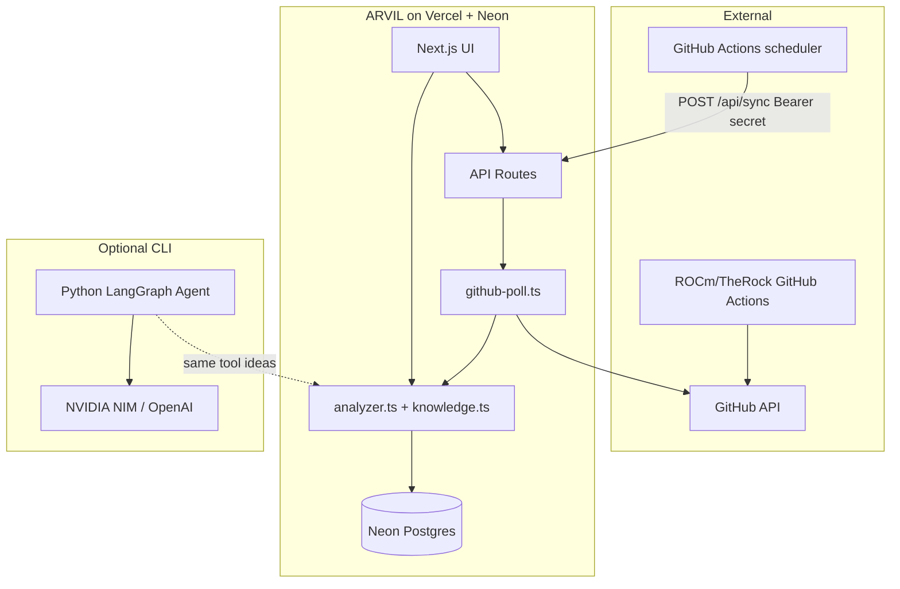
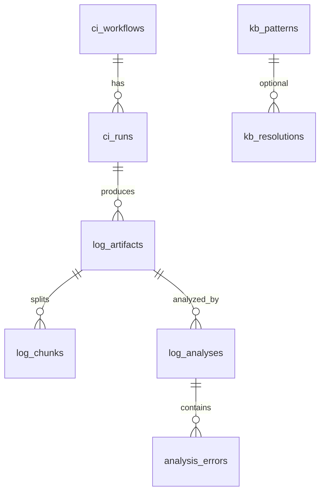

# ARVIL — System Design Document

**AI log qualification for TheRock / ROCm CI**  
**Author:** Rajeswari (portfolio project)  
**Repo:** https://github.com/rajipsv/ARVIL  
**Purpose:** Interview preparation — problem framing, architecture, tradeoffs, and talking points.

---

## 1. Executive summary

**ARVIL** (AI log qualification) helps validation and CI engineers triage failed GitHub Actions logs from **[ROCm/TheRock](https://github.com/ROCm/TheRock)** faster. It combines:

1. **Deterministic log tools** (grep, stats, GitHub `##[error]` detection) — predictable, no LLM cost on the web tier.
2. **RAG-style knowledge base** (keyword-ranked failure patterns for GPU/ROCm/install failures).
3. **Optional agentic path** (Python LangGraph ReAct agent with the same tools + NVIDIA/OpenAI LLM).
4. **Persistent history** (Neon Postgres schema v2 modeling workflows → runs → artifacts → analyses).
5. **Automated ingestion** (poll failed Actions runs via GitHub API; scheduled sync via GitHub Actions, not Vercel Cron on Hobby).

The web app is the primary product surface; Python is for deep CLI/MCP-style analysis and resume demonstration of LangChain/LangGraph.

---

## 2. Problem statement

| Pain | How ARVIL addresses it |
|------|-------------------------|
| Multi-GB CI logs; signal buried in noise | Chunking, keyword grep, job-level ingestion (not full repo logs) |
| Repeated ROCm/GPU failure modes | `patterns.json` + RAG lookup per error signature |
| Manual copy-paste from Actions UI | Poll API + “Sync now” + Neon history |
| LLM hallucination on unknown errors | Tool-first analysis; KB solutions attached only when pattern matches |
| Cost/latency on serverless | Web path uses **no LLM**; Python agent optional |

**Target user:** Principal / senior QE, CI validation lead (e.g. AMD ROCm validation context).

---

## 3. Goals and non-goals

### Goals

- Ingest failed TheRock workflow runs and store structured triage results.
- Support manual paste/upload for ad-hoc logs.
- Return actionable output: severity, category, line numbers, KB recommendations.
- Run on **Vercel Hobby + Neon free tier** with minimal ops.
- Demonstrate agentic design (tools bound to log session, ReAct loop) in Python.

### Non-goals (current version)

- Real-time streaming of live CI (webhooks not implemented).
- Full log object storage (S3/R2) — only preview + selective chunks in Postgres.
- Vector DB / embeddings (keyword RAG only).
- Multi-tenant auth / RBAC.
- Replacing GitHub’s own log viewer.

---

## 4. System context



---

## 5. High-level architecture

| Layer | Technology | Responsibility |
|-------|------------|----------------|
| **Presentation** | Next.js 14 App Router, React, Tailwind | Paste/upload logs, workflow presets, sync button, history |
| **API** | Route handlers `/api/analyze`, `/api/sync`, `/api/history` | Serverless orchestration, auth for sync |
| **Analysis engine (web)** | TypeScript `analyzer.ts` | Tool-like grep + RAG without LLM |
| **Ingestion** | `github-poll.ts` | List failed runs, download job logs, persist |
| **Data** | Neon serverless Postgres, `@neondatabase/serverless` | Schema v2 relational model + JSONB results |
| **Scheduler** | `.github/workflows/poll-therock.yml` | Cron every 30 min → HTTP POST to Vercel |
| **Agent (offline)** | LangGraph `create_react_agent`, LangChain tools | Deep log exploration with LLM summarization |

---

## 6. Core components

### 6.1 Web UI (`app/page.tsx`)

- **Workflow presets** map to TheRock jobs: Multi-Arch, Install, PyTorch wheels, Unit tests, Custom.
- **Manual analyze:** POST `/api/analyze` with `logContent`, `workflow`, `sourceLabel`.
- **Sync:** POST `/api/sync` with `{ maxRuns: 2 }` (same-origin allowed when `POLL_CRON_SECRET` is set).
- **History:** GET `/api/history` → recent analyses + polled failure runs dashboard.

### 6.2 Analysis engine — web (`lib/analyzer.ts`)

**Modes:**

| Mode | `analysis_mode` | When |
|------|-----------------|------|
| Default | `tool_rag` | Every analyze + GitHub poll sync |
| Deep | `tool_rag_llm` | UI **Deep analyze** when `NVIDIA_API_KEY` or `OPENAI_API_KEY` is set |

**Pipeline (default):**

1. `getLogStats` — line count, keyword counts (ERROR, CRITICAL, etc.), `##[error]` count.
2. `grepKeyword` / `grepGithubErrors` / `grepSubprocessFailures` — line hits.
3. `buildErrors` — dedupe lines, `lookupKnownFailure` per signature (min score 10; GPU patterns blocked on `git`/`subprocess` lines).
4. **`groupRootCauses`** (`lib/root-cause.ts`) — merge `CalledProcessError` stack lines, attach `##[error]` wrappers; `errors_count` = **group count**, not raw hits.
5. `rag_lookups` — top KB matches for primary signatures.
6. `summary` — e.g. “1 root cause (2 related log lines grouped)”.

**Root cause vs line-hit model:** A single CI failure often prints 3+ lines (Python `raise`, `subprocess.CalledProcessError`, GitHub `##[error] exit code 1`). ARVIL surfaces **one card** with collapsible related lines (`stack` | `wrapper`). Example: Multi-Arch run — `git diff` exit 128 maps to KB `git_diff_ci_fail`, not `rocm_hsa_status` from weak token `status`.

**Deep analyze:** `POST /api/analyze` with `{ deep: true, reanalyze: true }` runs rules first, then `lib/llm-group.ts` (NVIDIA NIM preferred, OpenAI fallback) to refine groups and add `deep_narrative`. Cached analyses are bypassed when `deep: true`. Neon stores `analysis_mode`, `llm_provider`, `llm_model` via `saveAnalysisV2`.

**LLM diag:** `GET /api/analyze?diag=1` → `{ nvidia_api_key_set, openai_api_key_set, llm_ready }` (no secrets).

**Test:** `npm run test:root-cause` — fixture L157–L159 → 1 group + `git_diff_ci_fail`.

**Design choice:** Rules on every path; LLM optional — fits Vercel limits and keeps scheduled sync deterministic.

### 6.3 Knowledge base / RAG (`lib/knowledge.ts`, `lib/data/patterns.json`)

- Patterns include: `id`, `pattern`, `category`, `severity`, `signatures[]`, `causes`, `solutions`, `similar_errors`.
- **Retrieval:** keyword overlap scoring (not embeddings) — fast, explainable, no vector infra.
- **Interview angle:** “Phase 2 RAG” — you can describe migration path to pgvector or NVIDIA embeddings without rewriting tools.

### 6.4 GitHub poll (`lib/github-poll.ts`)

**Flow:**

```
GITHUB_TOKEN + GITHUB_REPO (owner/name)
  → GET /repos/{owner}/{repo}/actions/runs?status=failure
  → skip runs already in ci_runs.github_run_id
  → GET /actions/runs/{run_id}/jobs
  → for failed jobs (max 1 per run on serverless):
       GET /actions/jobs/{job_id}/logs (302 → blob URL)
       unzip via jszip if archive
       insertArtifact → chunkLogContent → analyzeLog → saveAnalysisV2
```

**Limits (serverless):** `MAX_NEW_RUNS_PER_SYNC = 2`, `MAX_JOBS_PER_RUN = 1`.

**Important env contract:**

| Variable | Format | Example |
|----------|--------|---------|
| `GITHUB_REPO` | `owner/repo` only | `ROCm/TheRock` |
| **Wrong** | Full URL | `https://github.com/ROCm/TheRock` → API 404 |

404 on “List runs” almost always means malformed `GITHUB_REPO` or typo in owner/repo — not missing token (that tends to be 401/403).

### 6.5 Sync API (`app/api/sync/route.ts`)

| Concern | Behavior |
|---------|----------|
| **Auth** | If `POLL_CRON_SECRET` set: Bearer token OR `?secret=` OR `Sec-Fetch-Site: same-origin` for UI |
| **Diagnostics** | GET `/api/sync?diag=1` — `github_token_set`, `database_set` (no secrets leaked) |
| **Errors** | 503 if no `GITHUB_TOKEN`; 502 if poll returns zero ingested with errors |
| **Duration** | `maxDuration = 60` (Pro); Hobby still ~10s wall clock |

### 6.6 Database (`lib/db.ts`, `scripts/schema_v2.sql`)

**Entity-relationship (logical):**



| Table | Role |
|-------|------|
| `ci_workflows` | Stable workflow name per repo (seeded for TheRock) |
| `ci_runs` | One row per GitHub `workflow_run.id` (unique) |
| `log_artifacts` | One job log or manual paste; `ingestion_source`: `poll` \| `manual` |
| `log_chunks` | Windows of lines with `error_hit_count` (sparse storage) |
| `log_analyses` | Full `result_json` JSONB + summary |
| `analysis_errors` | Normalized errors for SQL/reporting |
| `kb_patterns` / `kb_resolutions` | DB-ready KB (seed file used in TS today) |

**Schema migration:** `ensureSchemaV2()` on first DB touch — idempotent `CREATE TABLE IF NOT EXISTS`.

### 6.7 Python agentic stack (`python/agentic/`)

**Phase 1 — Tools (`log_tools.py`):**

- `get_log_stats`, `grep_log`, `grep_error_keyword`, `read_log_window`, `chunk_overview`, `extract_stack_traces`
- `LogSession` binds tools to one file path per run.

**Phase 2 — RAG (`failure_kb.py`, `rag_tools.py`):**

- `lookup_known_failure`, `search_failure_knowledge` — same pattern JSON as web.

**Agent (`arvil_agent.py`):**

- LangGraph `create_react_agent` + system prompt enforcing tool use order.
- LLM: `NVIDIA_API_KEY` → integrate.api.nvidia.com; fallback `OPENAI_API_KEY`.
- `--tool-only` — deterministic path without LLM (parity with web).

**Phase 3 (planned):** MCP server stub in `python/workflow/mcp_server_integration.py` for Cursor IDE integration.

---

## 7. Data flows

### 7.1 Manual analysis

```
User paste/upload
  → POST /api/analyze
  → analyzeLog()
  → saveAnalysis() [optional if DATABASE_URL]
  → JSON AnalysisResult + saved_id
```

### 7.2 Automated poll (primary ingestion)

```
GitHub Actions cron (every 30 min)
  → curl POST https://app.vercel.app/api/sync
     Authorization: Bearer POLL_CRON_SECRET
  → pollTheRock()
  → Neon upsert ci_runs + artifacts + analyses
```

```
User clicks "Sync now"
  → same POST /api/sync (same-origin auth)
```

### 7.3 Analysis result shape (`AnalysisResult`)

```typescript
{
  timestamp, mode, workflow, source_label,
  line_count, errors_count, summary,
  errors: [{ type, line_number, message, severity, category, recommendation, kb_pattern_id }],
  rag_lookups: [{ error_signature, matches: FailureMatch[] }],
  stats: { lines, bytes, ERROR, ... }
}
```

---

## 8. API reference (summary)

| Endpoint | Method | Auth | Purpose |
|----------|--------|------|---------|
| `/api/analyze` | POST | None | Analyze pasted or synced log (`deep: true` for LLM) |
| `/api/analyze?diag=1` | GET | None | LLM env check (`llm_ready`, no secrets) |
| `/api/sync` | POST/GET | Secret / same-origin | Poll TheRock failures |
| `/api/sync?diag=1` | GET | None | Config health check |
| `/api/history` | GET | None | List analyses + polled runs |
| `/api/history?id=` | GET | None | Single analysis detail |

---

## 9. Security model

| Asset | Protection |
|-------|------------|
| `DATABASE_URL` | Server-only Vercel env |
| `GITHUB_TOKEN` | Server-only; PAT with **Actions: Read** on public `ROCm/TheRock` |
| `POLL_CRON_SECRET` | Bearer for external sync; blocks casual curl |
| UI sync | Same-origin header when secret configured |
| User logs | May contain paths/secrets — not committed; 5MB upload cap |

**Operational note:** Rotate any credentials shared during setup; never commit `.env.local`.

---

## 10. Deployment topology

| Service | Role |
|---------|------|
| **Vercel** | Host Next.js at repo root; serverless functions |
| **Neon** | Serverless Postgres (`DATABASE_URL`) |
| **GitHub Actions (ARVIL repo)** | Scheduler only — no `GITHUB_TOKEN` in ARVIL secrets |
| **GitHub API** | Target repo `ROCm/TheRock` using Vercel’s `GITHUB_TOKEN` |

**Why not Vercel Cron?** Hobby plan does not include reliable cron; GitHub Actions is free and explicit.

**Constraint:** Hobby function timeout ~10s → small batch sync (2 runs × 1 job).

---

## 11. Key design decisions (interview sound bites)

1. **Tool-first, LLM-optional**  
   *“We enforce tool use before synthesis so the agent cannot invent log lines. The web tier proves the tools alone deliver value.”*

2. **Keyword RAG over vectors (v1)**  
   *“For a bounded ROCm failure catalog, keyword scoring is debuggable and deployable without a vector DB. Embeddings are a v2 upgrade behind the same `lookup_known_failure` interface.”*

3. **Schema v2 models CI reality**  
   *“Runs and artifacts are first-class so we can correlate regressions across branches and workflows, not just store flat JSON blobs.”*

4. **302-aware log download**  
   *“GitHub job logs redirect to blob storage; we handle `manual` redirect so Authorization headers are not stripped incorrectly.”*

5. **Split scheduler and compute**  
   *“GitHub Actions wakes Vercel; Vercel holds secrets and DB. No long-running workers to maintain.”*

6. **Monorepo layout**  
   *“Next.js at root for Vercel auto-detection; Python isolated for CLI/agent demos.”*

---

## 12. Failure modes and troubleshooting

| Symptom | Likely cause | Fix |
|---------|--------------|-----|
| `List runs failed: HTTP 404` | `GITHUB_REPO` is full URL or wrong repo | Set `ROCm/TheRock` only |
| `HTTP 401/403` | Token missing or insufficient scope | Fine-grained PAT: Actions Read |
| `Unauthorized` on sync | `POLL_CRON_SECRET` mismatch | Match Vercel ↔ GitHub secret |
| `GITHUB_TOKEN is not set` | Env not set for Production | Vercel env + redeploy |
| Sync 0 runs, no errors | All recent failures already ingested | Expected; check `ci_runs` |
| Sync timeout | Log download + analyze > 10s | Reduce `maxRuns`; paste smaller logs |
| Empty analyses | Log has no ERROR/##[error] markers | Paste failed step only |

---

## 13. Evolution roadmap

| Phase | Feature |
|-------|---------|
| **Done** | Web tool+RAG, Neon v2, GitHub poll, GH Actions cron |
| **Done** | Python LangGraph agent + NVIDIA NIM |
| **Next** | Normalize `GITHUB_REPO` input; workflow-level run API filters |
| **Next** | History detail page, link to GitHub run URL |
| **Next** | MCP server for Cursor (Phase 3) |
| **Future** | Webhooks on `workflow_run.completed` |
| **Future** | pgvector / NIM embeddings for KB |
| **Future** | Object storage for full logs; chunk references only in DB |

---

## 14. Interview preparation

### 14.1 Elevator pitch (30 seconds)

> “ARVIL qualifies CI logs for ROCm’s TheRock project. It pulls failed GitHub Actions runs, extracts errors with deterministic tools, matches them against a ROCm-focused knowledge base, and stores triage in Postgres. The production UI runs without an LLM for cost and predictability; a LangGraph agent reuses the same tools for deeper CLI analysis with NVIDIA NIM.”

### 14.2 Likely questions and answers

**Q: Why two analysis paths (TS web vs Python agent)?**  
A: Web proves fast triage in serverless; Python demonstrates agentic orchestration and interview-relevant LangGraph patterns without coupling production to LLM latency/cost.

**Q: How would you scale ingestion?**  
A: Webhook → queue (SQS/Redis) → worker with higher timeout; store raw logs in R2; write chunks + analysis async; idempotent on `github_run_id`.

**Q: How do you prevent hallucinations?**  
A: System prompt requires tools first; recommendations come from KB `solutions` when `kb_pattern_id` matches; otherwise generic safe fallback string.

**Q: How do you test without TheRock access?**  
A: `example.log`, manual paste, mock GitHub API responses; `diag` endpoint for env validation.

**Q: What would you improve for AMD QE role?**  
A: GFX-specific pattern packs, ASAN workflow preset, junit/ctest parsers, dashboard for flake rate per workflow, integration with internal ticket system.

### 14.3 Metrics you could claim (if implemented)

- Time-to-first-error-signature: O(n) single pass + bounded grep hits.
- Sync batch: 2 runs × 1 job per request under 10s target.
- KB hit rate: track `kb_pattern_id IS NOT NULL` in `analysis_errors`.

### 14.4 STAR story template

- **Situation:** Large TheRock CI logs, repeated GPU/driver failures.  
- **Task:** Reduce triage time for validation engineers.  
- **Action:** Built ARVIL with poll ingestion, tool+RAG web analyzer, Neon history, agentic Python path.  
- **Result:** Structured JSON triage, persisted history, schedulable sync without Vercel Cron Pro.

---

## 15. Executive metrics (management / AMD CI)

**Routes:** `/dashboard` (live KPIs) · `/report?period=7d` (print / Save as PDF) · `GET /api/metrics?period=7d|30d`

### KPI definitions

| KPI | Definition |
|-----|------------|
| Failures qualified | Distinct `log_analyses` in period |
| Auto-triage coverage | % polled `log_artifacts` with an analysis |
| Known-issue rate | % `analysis_errors` with `kb_pattern_id` |
| Critical concentration | % errors with severity CRITICAL |
| Est. hours saved | `failures_qualified × ARVIL_MANUAL_TRIAGE_MINUTES ÷ 60` (default 45 min) |
| TheRock streams | Breakdown by `ci_runs.workflow_preset` |
| Repeat signatures | Same `kb_pattern_id` on ≥2 runs in 14d |

### Presentation talking points (AMD)

1. **Problem:** TheRock CI failures require 30–90 min senior QE log review each.  
2. **Solution:** ARVIL auto-intake + qualification + ROCm KB — validation intelligence, not a log viewer.  
3. **Outcomes:** failures qualified/week, known-signature %, hours saved (labeled assumption), stream/category charts for funding decisions.  
4. **Alignment:** Multi-Arch / PyTorch wheels / install streams → ROCm release confidence.

### Engineer vs executive surfaces

| Surface | User | URL |
|---------|------|-----|
| Engineer console | QE / validation | `/` |
| Executive dashboard | Directors / program leads | `/dashboard` |
| Executive report | QBR / email / slides | `/report` |

---

## 16. Repository map

```
ARVIL/
  app/
    dashboard/            # Executive KPI dashboard
    report/               # Printable executive summary
    api/metrics/          # KPI JSON
  components/
    executive-metrics.tsx # Shared exec UI
  lib/
    metrics.ts            # SQL aggregates + demo fallback
    analyzer.ts           # Web analysis engine
    github-poll.ts        # TheRock ingestion
    db.ts                 # Neon access + schema v2
  scripts/schema_v2.sql
  python/agentic/
  .github/workflows/
  DESIGN.md
```

---

## 17. Related reading

- [ROCm/TheRock](https://github.com/ROCm/TheRock) — target CI repository  
- [GitHub Actions API — workflow runs](https://docs.github.com/en/rest/actions/workflow-runs)  
- [GitHub Actions API — job logs](https://docs.github.com/en/rest/actions/workflow-jobs#get-download-job-logs-for-a-workflow-run) (302 redirect)  
- LangGraph ReAct agent pattern — tool-bound sessions for large inputs  

---

*Document version: 1.1 — includes executive dashboard, report export, and KPI API.*
